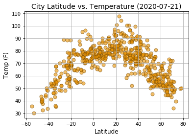
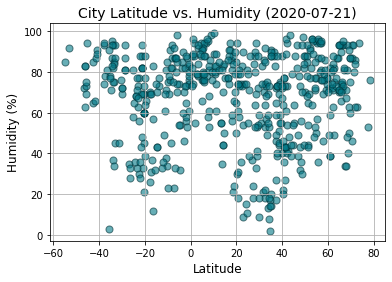
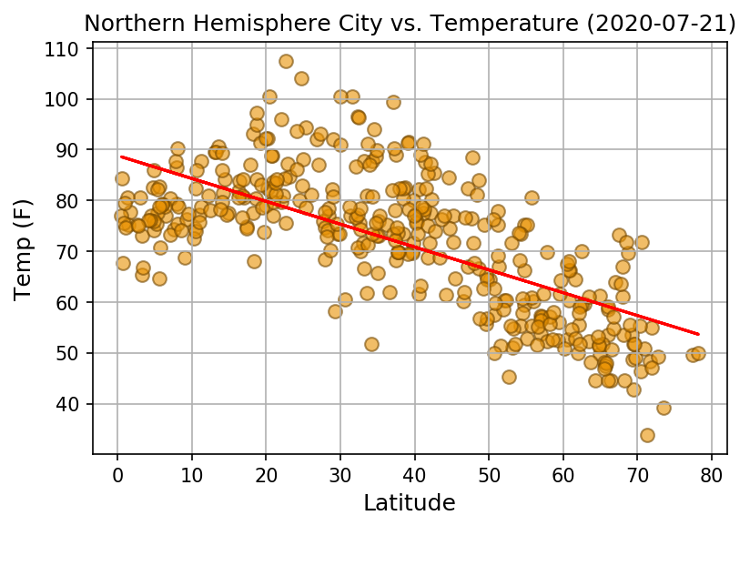
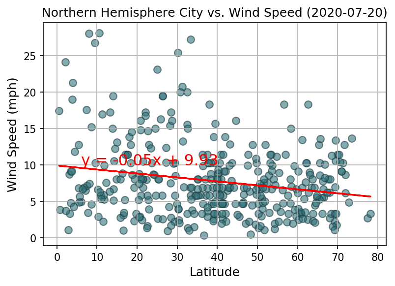
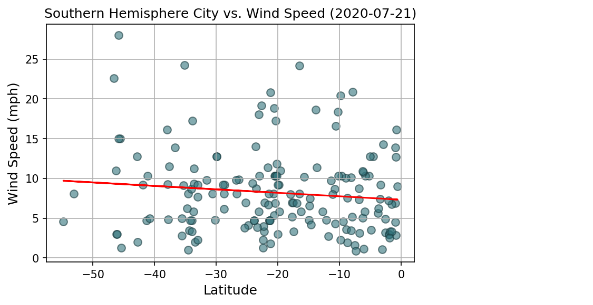

# Python API - What's the Weather Like?
---
I believe I found some nice spots for a vacation!

&nbsp;
&nbsp;
# Analysis of the WeatherPy City Data
* Temperature is the only scatter plot that shows moderate to strong linear relationship.
* Humidity, Cloudiness, and Wind Speed tend to vary through out the world.
* Wind Speed had a subtle linear relationship in the Southern Hemisphere, with Wind Speeds a bit higher near the south pole. This increase in wind speed could be because it is currently winter in the Southern Hemisphere.
* I noticed a trend that there are more cities in the Northern Hemishere.
---
# Analysis of the VacationPy Map Data
* It appears most vacation spots picked (by my temp, humidity, wind, cloudiness settings), tend to be in the Northern Hemisphere. This is probably because there are more cities in the Northern Hemisphere with Hotels close by and that it is summer in the Northern Hemisphere.
---
&nbsp;
&nbsp;

# Analysis of the Latitude vs. Temp Plot
* This scatter plot clearly depicts the rise of temperature from the Southern Hemisphere's lowest latitude (-60) to the equator (0) and the Northern's highest latitude (80) to the equater (0).
* We can also cleary see there are more cities, in general, in the Northern Hemisphere.
---

# Analysis of the Latitude vs. Humidity Plot
* This scatter plot shows that humidity level, world wide, has low correlation to latitude.
* Lower levels Humiduty and higher variance of Humidity, are recorded closer to the equator.
---

# Analysis: Linear regression of the City Latitude vs Temperature plot
* The data in this plot depicts no "standard" linear regression. 
* In this case the plot depicts two distinct arc values in the plotted data. 
* We would be best showing multi-regression lines on this plot for each hemisphere's latitude range.
---

# Analysis: N. Hemisphere Linear regression of Latitude vs Temperature plot
* The data shows a moderate linear relationship in temperature. The temp lowering as you get father away from the equator. 
---

# Analysis: S. Hemisphere Linear regression of Latitude vs Temperature plot
* The data shows a strong linear relationship in temperature. The temp rising as you get closer to the equator.
* This Southern linear relationship (0.8) may be slightly stronger than the Northern's linear relationship (-0.68), because of the winter and less cities. More research should be done on this possible correlation.
---

# Analysis: N. Hemisphere Linear regression of Latitude vs Humidity plot
* The data shows a weak linear relationship in Humidity. .
* This is not suprising because humidity has high vaiance world wide. 
---

# Analysis: S. Hemisphere Linear regression of Latitude vs Humidity plot
* The data shows a weak linear relationship in Humidity. .
* This is not suprising because humidity has high variance world wide.
---

# Analysis: N. Hemisphere Linear regression of Latitude vs Cloudiness plot
* The data shows a weak linear relationship in Cloudiness. .
* This is not suprising because Cloudiness has high variance world wide.
---

# Analysis: S. Hemisphere Linear regression of Latitude vs Cloudiness plot
* The data shows a weak linear relationship in Cloudiness. .
* This is not suprising because Cloudiness has high variance world wide.
---

# Analysis: N. Hemisphere Linear regression of Latitude vs Wind Speed plot
* The data shows a weak linear relationship in Wind Speed. .
* This is not suprising because Wind Speed has high variance world wide.
* There seems to be some higher rates of Wind Speed near the equator.
---

# Analysis: S. Hemisphere Linear regression of Latitude vs Wind Speed plot
* The data shows a weak linear relationship in Wind Speed. .
* This is not suprising because Wind Speed has high variance world wide.
* There seems to be some higher rates of Wind Speed near the South Pole. This could be because it is currently winter in the Southern Hemisphere.
